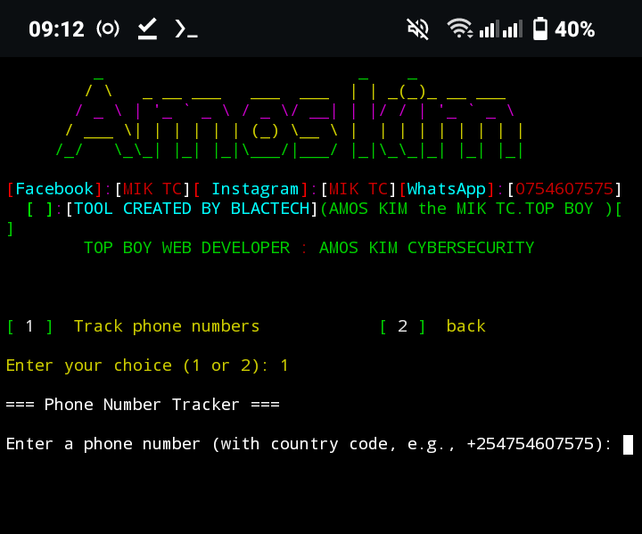

# PhoneTruckerByMICTC-TOPBOY

 Tool created by amos kim

## IP-Tracer

IP-Tracer is used to track an ip address. IP-Tracer is developed for Termux and Linux based systems. you can easily retrieve ip address information using IP-Tracer. IP-Tracer use ip-api to track ip address.

  

## How to install IP-Tracer ?

* `apt update`

* `apt  git -y`

* `https://github.com/amoskim318/PhoneTruckerByMICTC-TOPBOY.git`

* `cd PhoneTruckerByMICTC-TOPBOY`

* `chmod +x *`

* `python AMTOPKIM.py` or `

## How to use honeTruckerByMICTC-TOPBOY

* `1` to track phone number.
* `2` for more information.

**This project is  actively maintained.**
